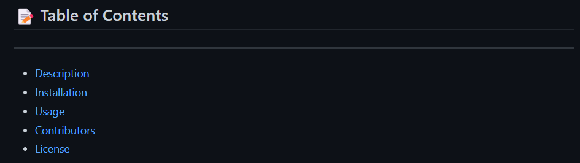

# ReadME Generator

## Description
---
This application takes user input and creates a readme file.
readme.png
## 📝 Table of Contents
---
- <a href="#description">Description</a>
- <a href="#installation">Installation</a>
- <a href="#usage">Usage</a>
- <a href="#contributors">Contributors</a>
- <a href="#license">License</a>
- <a href="#questions">Questions</a>
- <a href="#tests">Tests</a>

## Installation
---
Download Node Version 16

## Usage
---
Run 'node index.js' in the command line and input information wanted on a readme file.

www.google.com

## Contributors
---
Justus Schoppmann

## Tests
---
No tests used

## Questions
---
Visit https://github.com/Azurelo/ or contact justusschoppmann@yahoo.com for any questions.

## Link
---
N/A

## License
---

  ReadME Generator is distributed under the MIT license.
  More information can be found here: https://opensource.org/licenses/MIT
  
