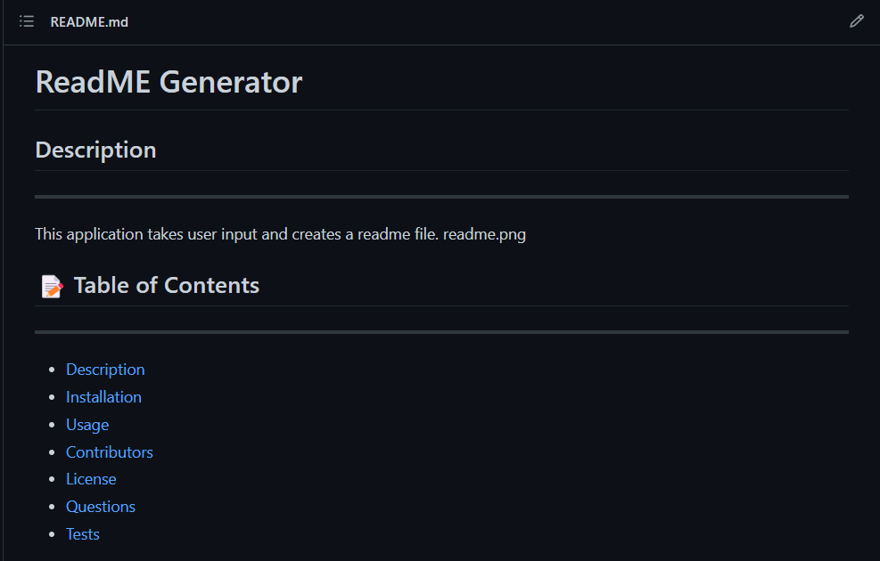

# README.md Generator

## Description
This application takes user input from the terminal and generates a professional README.md file.
readme.png
## 📝 Table of Contents
- <a href="#description">Description</a>
- <a href="#installation">Installation</a>
- <a href="#usage">Usage</a>
- <a href="#contributors">Contributors</a>
- <a href="#license">License</a>
- <a href="#questions">Questions</a>
- <a href="#tests">Tests</a>

## Installation
Clone the repository and then run 'node i'.

## Usage
Run 'node index.js' in the terminal and input information wanted on the README.md file.

https://drive.google.com/file/d/1J8Y4ANCOpxaQ5Udb6ChafXxerTCP7QQb/view

## Contributors
Justus Schoppmann

## Tests
No testing applied.

## Questions
Visit https://github.com/Azurelo/ or contact justusschoppmann@yahoo.com for any questions.

## Link
N/A

## License

  README.md Generator is distributed under the MIT license.
  More information can be found here: https://opensource.org/licenses/MIT

